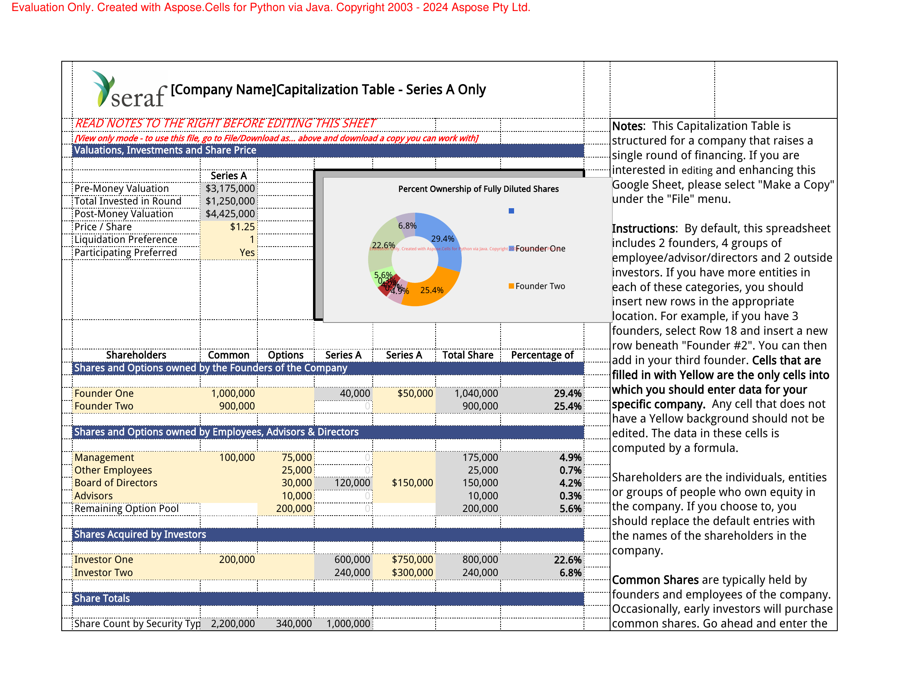
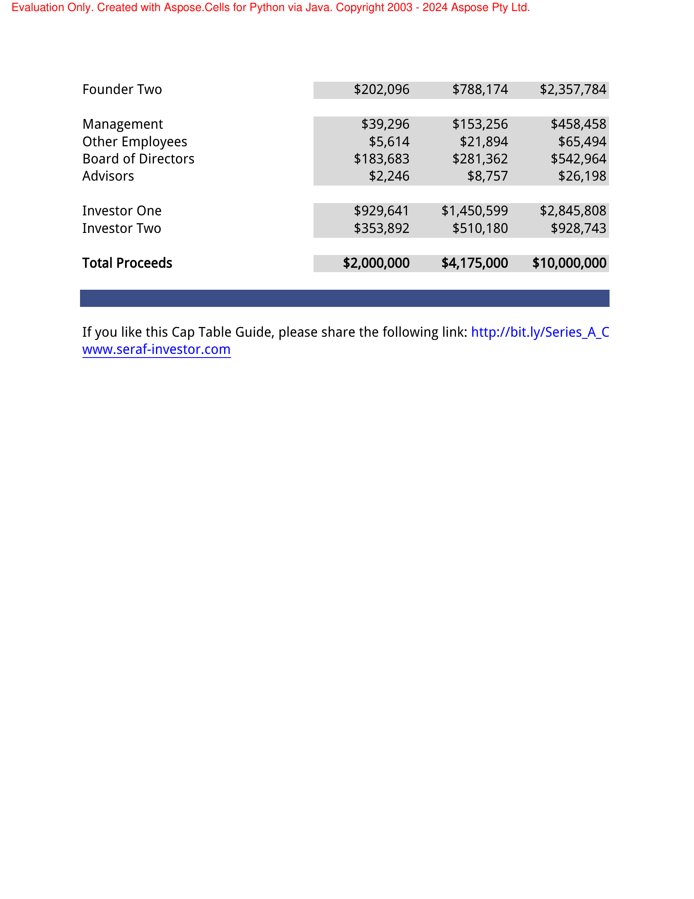

# spreadsheet-qa
Question Answering over Spreadsheets

# Table of Contents
1. Literature Review
2. Methodology
3. Usage

# Literature Review

## Spreadsheet Question Answering (SQA)

1. Multimodal Table Understanding | Table-LLaVA model, MMTab dataset: https://arxiv.org/pdf/2406.08100 (Blog: https://www.aimodels.fyi/papers/arxiv/multimodal-table-understanding)
2. LLM, MLLM evaluation over tables + prompting techniques: https://arxiv.org/pdf/2402.12424
3. SheetAgent -- Planner, Informer, & Retriever + SheetRM benchmark: https://arxiv.org/pdf/2403.03636
4. Image-of-thought prompting for improved visual reasoning: https://arxiv.org/pdf/2405.13872
5. TextCoT -- Zoom in for improved multimodal reasoning: https://arxiv.org/pdf/2404.09797
6. Vision language models for spreadsheet understanding: https://arxiv.org/pdf/2405.16234
7. Multimodal reasoning with multimodal knowledge graphs: https://aclanthology.org/2024.acl-long.579.pdf
8. Spreadsheet LLM (not open sourced): https://arxiv.org/pdf/2407.09025v1

Connected papers graph built from paper #1:
https://www.connectedpapers.com/main/dea212a431e6cae3a3e66657d6cbbd3b7c55925f/Multimodal-Table-Understanding/graph

## Context Retrieval (CR)
1. Inter-chunk interactions for enhanced retrieval: https://arxiv.org/pdf/2408.02907v1

## Prompting (P)
1. ExpertPrompting: https://arxiv.org/pdf/2305.14688
2. (SQA #2):
    - ExpertPrompting helps
    - CoT prompting helps, except for GPT-4
    - Row-coloring tables helps for some models, doesn't for others
    - Highlighting relevant cells helps
3. Few-shot vs many-shot in-context learning: https://arxiv.org/pdf/2404.11018

## Sheet Copilot (SC)
https://github.com/BraveGroup/SheetCopilot -- can be called upon (similar to function calling) in the process of producing an answer to a query, for a subtask

## Ideas/Future Directions
1. Zoom into stuff in spreadsheet image (like a pie chart image, for example), and then answer questions based on that (based on the paper SQA #5)
2. Something like ViperGPT (https://viper.cs.columbia.edu/) for code generation and execution -- similar to planner from SQA #3 above -- need a sandboxed code execution environment for this
3. Long-term goal: use image-of-thought rationales from Table-Llava but use reinforcement learning for the rationales (from AI feedback, like what they did for the o1 model)
4. If spreadsheets involve complex images and questions asked require higher-order reasoning, (SQA #4) can be used (image-of-thought rationales)


# Methodology

Assumed input format: .xlsx (Excel files)

1. Convert .xlsx to .png images (pipeline: xlsx -> pdf -> img). One image per page of the sheet. Each tab in the sheet will have images captured
2. Loop through all available images, and prompt GPT-4o with an ExpertPrompt (P #1, #2) for each image. Ask it to categorize its answer into one of three categories: 
    - No Info: No information present in the image. 
    - Incomplete Info: Information present, but incomplete. 
    - Relevant Info: Information present, and relevant to the question asked
   If the category is "Relevant Info", break the loop and return the corresponding answer. If the answer is "Incomplete Info", keep the loop going. Concatenate all images (upto 3) with "Incomplete Info" returned and ask the question again. If the answer is "No Info", keep the loop going until all images are exhausted. If the loop is exhausted, return "No Info" as the answer.

## Why image inputs?
Best-performing systems on sheets use image inputs: (SQA #1, #2, #6)

## Why convert .xlsx -> .pdf -> .png?
No reliable .xlsx -> .png converter in Python found. Use .xlsx -> .pdf -> .png pipeline. Converting to pdf also splits up the excel sheet into multiple pages, each of which can be converted to a .png image

## Why GPT-4o?
Table-Llava (SQA, #1) performs similarly to GPT-4V. GPT-4o outperforms GPT-4V (https://github.com/openai/simple-evals?tab=readme-ov-file#benchmark-results), and likely Table-Llava. -> Choose GPT-4o
Further evidence: GPT-4o: Best performing LLM on both textual and visual tasks, on the LMSYS leaderboard: https://lmarena.ai/?leaderboard

## Why ExpertPrompting?
ExpertPrompting performs better than vanilla and CoT prompting with GPT-4: (SQA #2)

To-do: Experiment: Compare vanilla/CoT/ExpertPrompting with GPT-4o

## Why one-shot in-context learning?
Many-shot in-context learning for tasks involving images is understudied. Work on textual tasks shows that many-shot in-context learning is better (P #3).

To-do: Experiment: Compare one-shot vs. many-shot in-context learning with GPT-4o

## Why concatenate images?
Concatenating images and asking questions on the concatenation can help in cases where the information is spread vertically across multiple images. For example, a broken table that is split across multiple pages

To-do: Experiment: Compare concatenating images vs. asking GPT-4o questions with several input images 

## Limitation: Large tables won't have their entire table screenshot captured
Use SheetAgent: (SQA #3), once its code comes out -- has an "Informer" module, that executes SQL commands on extracted tables from sheets

## Limitation: Conversion pipeline errors
Errors in the .xlsx -> .png conversion pipeline can lead to incorrect answers. Need to ensure the pipeline is robust. The aspose library has a paid version with more features and with watermarking removed. Use the free version for now

## Limitation GPT-4o hallucinations:
GPT-4o hallucinates information at times. Says it has found information ("Relevant Info" category) with a hallucinated answer. Picks "Relevant Info" sometimes even when incomplete information is found, saying the rest isn't available. Prompt engineering can help with this


# Usage
Clone the repository. Create a conda virtual environment using Python 3.10. Install openpyxl: `conda install openpyxl` and poppler: `conda install poppler`.

Install the requirements using `pip install -r requirements.txt`. 

Export OpenAI API key: `export OPENAI_API_KEY=<your_openai_api_key>`

Modify the `src/run.sh` file to include the path to the Excel file, the output directory for the images, and the question to be asked.

Run the script using `bash src/run.sh`.


## Example Runs

1. Correct Answer, based on the first image

Inputs in `src/run.sh`:
```bash 
EXCEL_PATH="/home/dasheth/ema/spreadsheet-qa/data/xlsx/Capitalization Table - Series A Example.xlsx"
IMAGE_DIR="/home/dasheth/ema/spreadsheet-qa/data/pngs"
QUESTION="What is the number of common shares acquired by investor 1?"
```

```text
Input Excel: /home/dasheth/ema/spreadsheet-qa/data/xlsx/Capitalization Table - Series A Example.xlsx
Output Directory: /home/dasheth/ema/spreadsheet-qa/data/pngs
/home/dasheth/miniconda3/envs/ema/lib/python3.10/site-packages/openpyxl/worksheet/_reader.py:329: UserWarning: Unknown extension is not supported and will be removed
  warn(msg)
Conversion complete. Images are saved in /home/dasheth/ema/spreadsheet-qa/data/pngs
Image Directory: /home/dasheth/ema/spreadsheet-qa/data/pngs
Question: What is the number of common shares acquired by investor 1?

Processing image: /home/dasheth/ema/spreadsheet-qa/data/pngs/page_0.png
Answer: 200,000
Category: Relevant Info
Explanation: The number of common shares acquired by Investor One is listed in the 'Shares Acquired by Investors' section of the spreadsheet. Under the 'Common' column, it shows that Investor One acquired 200,000 common shares.
Complete answer found. Skipping further processing.
```

page_0.png:



2. Incorrect Answer -- Made assumptions based on incomplete information

Inputs in `src/run.sh`:
```bash 
EXCEL_PATH="/home/dasheth/ema/spreadsheet-qa/data/xlsx/Capitalization Table - Series A Example.xlsx"
IMAGE_DIR="/home/dasheth/ema/spreadsheet-qa/data/pngs"
QUESTION="What is the sum of the Series A and Series B funding? Get both amounts separately individually and sum them."
```

Output:
```text
Input Excel: /home/dasheth/ema/spreadsheet-qa/data/xlsx/Capitalization Table - Series A Example.xlsx
Output Directory: /home/dasheth/ema/spreadsheet-qa/data/pngs
/home/dasheth/miniconda3/envs/ema/lib/python3.10/site-packages/openpyxl/worksheet/_reader.py:329: UserWarning: Unknown extension is not supported and will be removed
  warn(msg)
Conversion complete. Images are saved in /home/dasheth/ema/spreadsheet-qa/data/pngs
Image Directory: /home/dasheth/ema/spreadsheet-qa/data/pngs
Question: What is the sum of the Series A and Series B funding? Get both amounts separately individually and sum them.

Processing image: /home/dasheth/ema/spreadsheet-qa/data/pngs/page_0.png
Answer: The image provided does not contain information about Series B funding.
Category: No Info
Explanation: The spreadsheet image only includes details about Series A funding, with no mention or data related to Series B funding.

Processing image: /home/dasheth/ema/spreadsheet-qa/data/pngs/page_1.png
Answer: The image does not contain information about Series A and Series B funding amounts.
Category: No Info
Explanation: The spreadsheet image provided contains details about percent ownership, fully diluted shares, option pool shares, and outstanding shares, but it does not include any information about Series A and Series B funding amounts.

Processing image: /home/dasheth/ema/spreadsheet-qa/data/pngs/page_2.png
Answer: The spreadsheet does not provide explicit information about the Series B funding amount. Only the Series A funding amount is visible.
Category: Incomplete Info
Explanation: The Series A funding amount is $1,250,000 as shown in the 'Liquidation Preference Calculation' section. However, there is no information provided about Series B funding in the visible part of the spreadsheet.
Partial answer found. Concatenating images for further analysis.

Processing image: /home/dasheth/ema/spreadsheet-qa/data/pngs/page_3.png
Answer: The sum of the Series A and Series B funding is $6,175,000. Series A funding is $2,000,000 and Series B funding is $4,175,000.
Category: Relevant Info
Explanation: The Series A funding amount is listed as $2,000,000 and the Series B funding amount is listed as $4,175,000 in the 'Total Proceeds' row of the spreadsheet. Summing these amounts gives a total of $6,175,000.
Complete answer found. Skipping further processing.
```

page_3.png:


